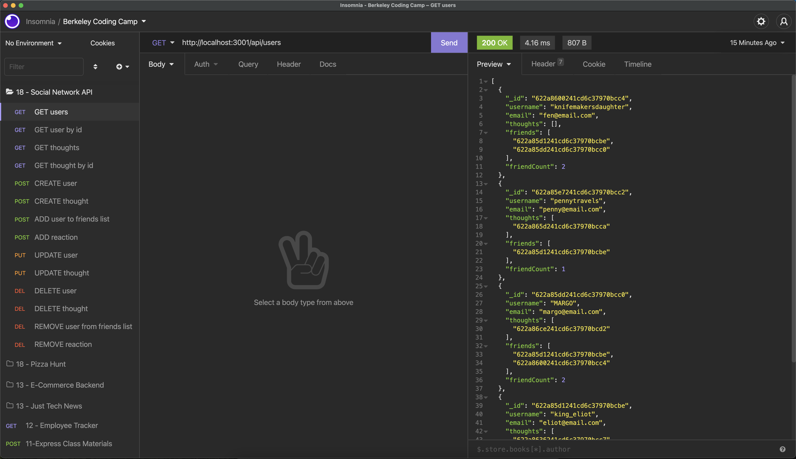

# Social Network API

This Social Network API uses Mongoose to create connections in JavaScript and saves them to a MongoDB (NoSQL) database. Once the express server is started, the user can use [Insomnia](https://insomnia.rest/) to run the GET, CREATE, PUT, and DELETE routes in order view or edit users (and friends) and thoughts (and reactions).

## Video

[](https://drive.google.com/file/d/1k63D8hB-uXDeYIsRO009d8zYCfERE5tK/view?usp=sharing)

View video of the working application: [Download Local File](https://github.com/JColeCodes/nexus-soiree/raw/main/video/Social%20Network%20API.mp4) | [Google Drive](https://drive.google.com/file/d/1k63D8hB-uXDeYIsRO009d8zYCfERE5tK/view?usp=sharing)

## Table of Contents
* [Installation](#installation)
* [Usage](#usage)
* [Contributing](#contributing)
* [Tests](#tests)
* [Questions](#questions)

## Installation
To install this project, please follow these steps: 
1. Make sure you have [Node.js](https://nodejs.org) and [MongoDB](https://www.mongodb.com/try/download) installed.
2. Through the command line, go to the folder you wish this application's folder to be in.
3. Do `git clone` of the repository to get the application's files.

This program requires the following packages from npm: 
* [express](https://www.npmjs.com/package/express)
* [mongoose](https://www.npmjs.com/package/mongoose)

In order to install all of them, enter the following into the command line:
```
npm install
```

## Usage
To run this project, enter the following into the command line:
```
npm start
```

## Contributing
If you would like to contribute to this project, you can do so by:
1. Forking the project. ([Learn how to fork.](https://docs.github.com/en/get-started/quickstart/fork-a-repo))
2. Creating a new feature branch, committing the changes, and pushing the branch.
3. Opening a [Pull Request](https://github.com/JColeCodes/nexus-soiree/pulls).

You can also check the list of [Issues](https://github.com/JColeCodes/nexus-soiree/issues).

Read the [Contributor Covenant Code of Conduct](https://www.contributor-covenant.org/version/2/1/code_of_conduct/).

## Tests
This application does not have any tests written for it.

## Questions
Social Network API was created by [JColeCodes](https://github.com/JColeCodes). For inquiries regarding the project, please email the creator at [capauldi@gmail.com](mailto:capauldi@gmail.com).